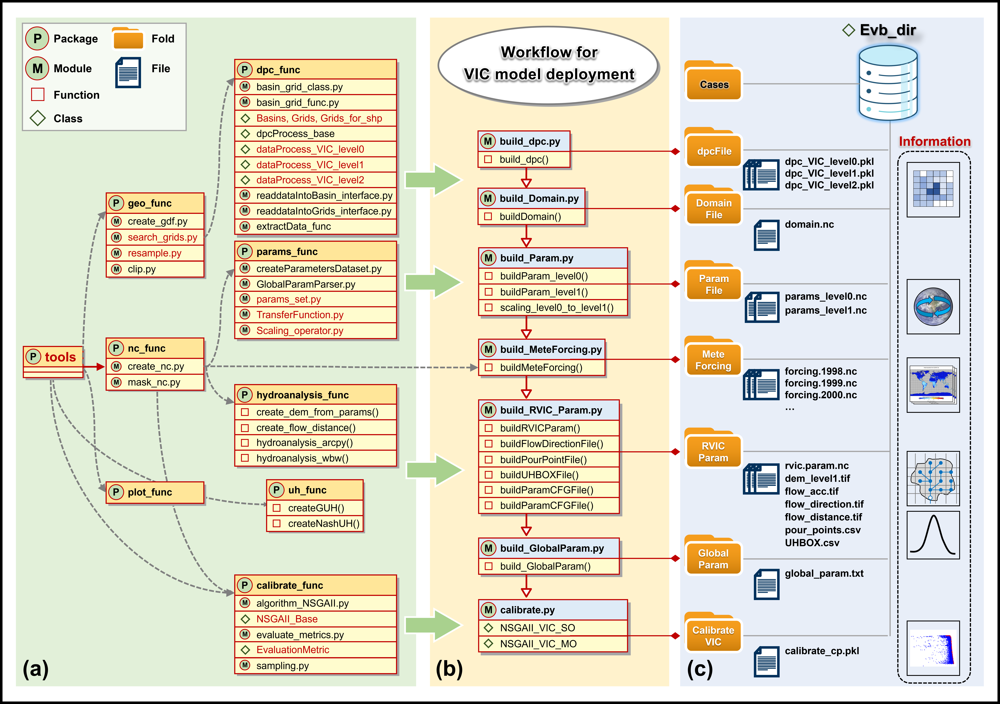

# easy_vic_build

This is an open-source Python package for deploying the VIC model.  


## Installation

To install the package, run one of the following commands:

- Basic installation:

  ```bash
  pip install easy_vic_build
  ```

- For additional dependencies, choose one of the following options:
  ```bash
  pip install easy_vic_build[nco]
  pip install easy_vic_build[rvic]
  pip install easy_vic_build[nco_rvic]
  ```

Alternatively, you can install from a `.whl` file:

- Basic installation:

  ```bash
  pip install .whl
  ```

- For additional dependencies:
  ```bash
  pip install .whl[nco]
  pip install .whl[rvic]
  pip install .whl[nco_rvic]
  ```

Choose the appropriate installation based on your environment requirements.

For development purposes, you can install the package directly from the repository:

```bash
git clone https://github.com/XudongZhengSteven/easy_vic_build
cd easy_vic_build
pip install -e .
```

## Usage

After installation, you can use the package in the following sequence:

1. **Build DPC** (`build_dpc`)
2. **Build Domain** (`build_Domain`)
3. **Build Parameters** (`build_Param`)
4. **Perform Hydroanalysis** (`build_hydroanalysis`)
5. **Plot Basin Map** (`plot_Basin_map`)  
   (Note: You must first run `hydroanalysis_for_basin`)
6. **Build Meteorological Forcing** (`build_MeteForcing`) or (`build_MeteForcing_nco`)
7. **Build RVIC Parameters** (`build_RVIC_Param`)
8. **Build Global Parameters** (`build_GlobalParam`)
9. **Calibrate the Model** (`calibrate`)
10. **Plot VIC Results** (`plot_VIC_result`)

## Features

- Easily deploy the VIC model with multiple configuration options.
- Integrated support for different meteorological forcing formats.
- Support for hydrological analysis and visualization of results.

## Documentation

For detailed documentation, please refer to the [documentation website](#) or view the [API documentation](#).

## Contributing

If you wish to contribute to this project, feel free to fork the repository and submit pull requests. Please ensure that you follow the project's coding guidelines and add relevant tests for new features.

## License

This project is licensed under the MIT License. See the [LICENSE](LICENSE) file for more details.

## Contact

- **Author**: Xudong Zheng
- **Email**: zhengxd@sehemodel.club
- **GitHub**: [@XudongZhengSteven](https://github.com/XudongZhengSteven)

## Notes

1. **Testing GitHub Workflow**  
   This section is to test the GitHub Actions workflow.
2. **RVIC Compilation Note**  
   Please note that **RVIC** should not be compiled with **VIC** if you wish to use parallel processing (e.g., `mpiexec`).

   There are two types of compilation:

   - **Compile VIC with RVIC**:  
     You can run VIC with RVIC and set different timesteps.
   - **Compile VIC without RVIC**:  
     You can run VIC in parallel, but you will need to run RVIC separately (`rvic.convolution.convolution`).  
     Make sure to prepare the `rvic.convolution.cfg` configuration file.  
     Additionally, ensure that the VIC output timestep (daily or hourly) matches the UHBOX timestep (86400 seconds for daily, 3600 seconds for hourly).

## Citation

If you use this package in your research, please cite it as follows:

```plaintext
Zheng, X. (Year). easy_vic_build: A Python package for VIC model deployment. Retrieved from https://github.com/XudongZhengSteven/easy_vic_build
```
